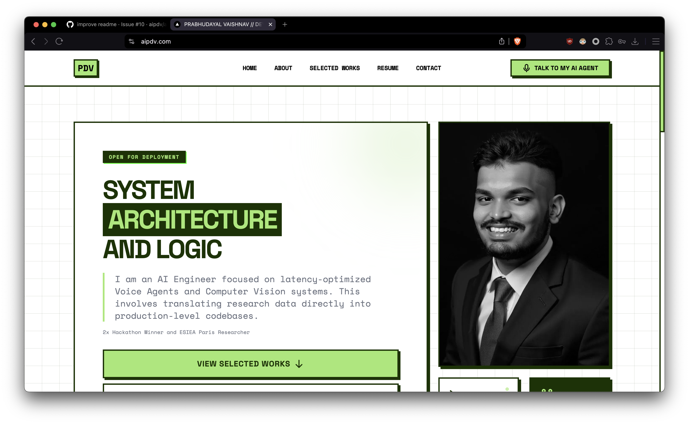
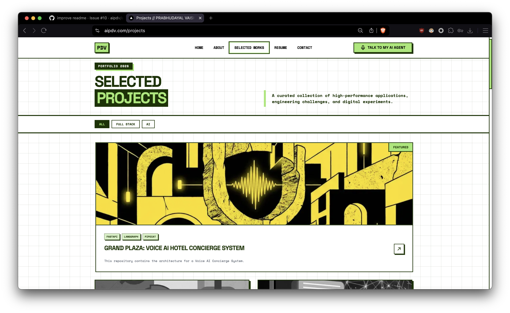
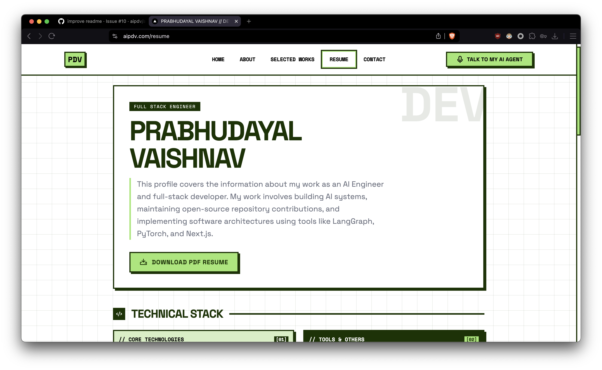
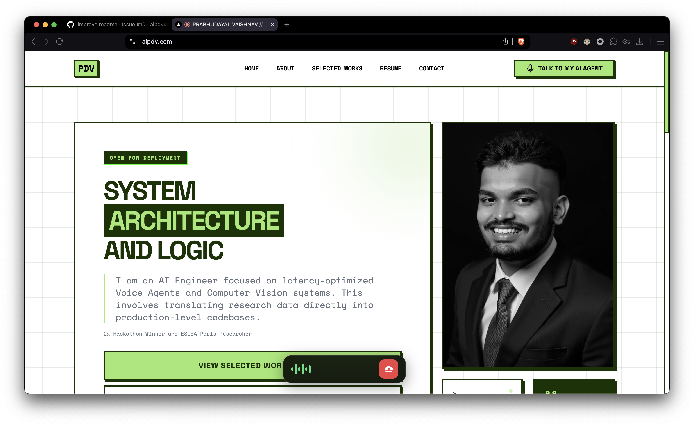

# aipdv.com

A Neobrutalistic AI Portfolio featuring Mira, a tool-enabled voice assistant. Built with Next.js 15, TypeScript, and Google Gemini Live.

## Interface

- _Landing page_


- _Project showcase page_


- _Resume page_


- _Voice mode with Mira_


## Core Features

- **Neobrutalistic UI**: High-contrast, heavy borders, and vibrant accents for technical clarity.
- **Mira Voice AI**: Real-time Gemini-powered assistant for project and resume inquiries.
- **Voice Navigation**: Natural language page routing (Projects, Resume, About).
- **Architecture**: Fully responsive, multi-device optimized layouts using Framer Motion and GSAP.
- **Validated Work**: Integrated spotlight for hackathon wins and research contributions.

## Technical Stack

- **Framework**: Next.js 15 (App Router) / React 19
- **Logic**: TypeScript / Google Gemini AI / Bun
- **Styling**: Tailwind CSS 3 / Framer Motion 12 / GSAP / Phosphor Icons

## Project Structure

```
├── app/                    # Next.js routes (Landing, Resume, Projects)
├── components/            # VoiceOrb, LiveChatModal, NeoNavbar, Constants
├── services/              # AI and business logic
└── tailwind.config.js     # Neobrutal design configuration
```

## Setup

1. **Clone & Install**: `git clone`, then `bun install`.
2. **Environment**: Add `NEXT_PUBLIC_GEMINI_API_KEY` to `.env.local`.
3. **Launch**: `bun dev`.

## Mira Functionality

Mira acts as a tool-enabled agent:

- **Navigation**: Directs users to site sections via speech.
- **Data Retrieval**: Fetches resume details directly from `constants.ts`.
- **Performance**: Optimized WebRTC flow for minimal voice latency.

## License & Contact

- **License**: MIT
- **Contact**: hi@aipdv.com | [LinkedIn](https://www.linkedin.com/in/aipdv) | [aipdv.com](https://aipdv.com)
